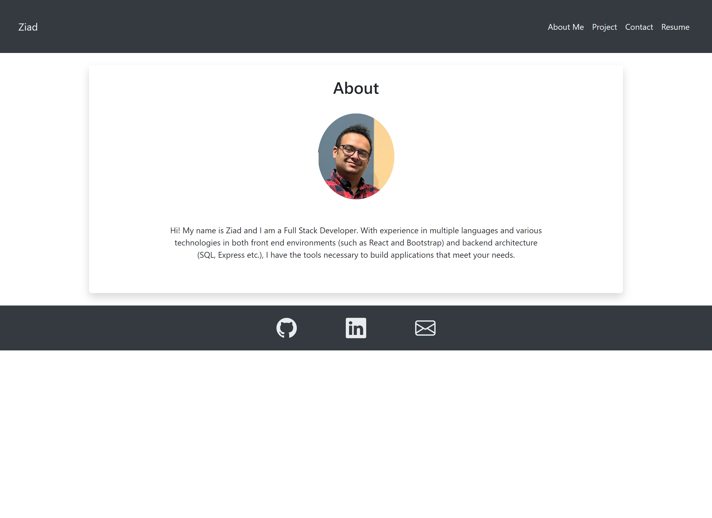

# React Portfolio
## Description
This is the repository for my portfolio where I show the awesome projects I've worked on, either solo or as part of a group.
## Table of Contents

- [Description](#description)
- [Installation](#installation)
- [Usage](#usage)
- [Questions](#questions)
## Installation
This is only the front-end code. Repository can be cloned to your machine and run locally..

## Usage
Visit https://z-alfadl.github.io/React-Portfolio/

## Questions
For any questions you can reach out to me at:

My Email: [ziad.t.alfadl@gmail.com](mailto:ziad.t.alfadl@gmail.com)

My GitHub: [https://github.com/Z-Alfadl](https://github.com/Z-Alfadl)
